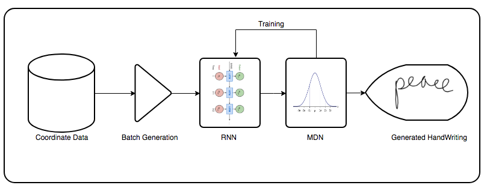
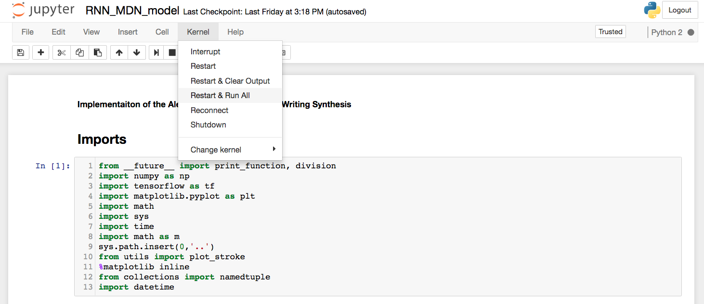

# Hand Wiriting Generator

This is an implemenation of the Alex Graves [paper](https://arxiv.org/pdf/1308.0850.pdf). This is an implementation of Section 4. The code generates natural looking hand writing. The figure below shows a high-level overview of the implementation.




# Train:
The entire code for the batching data and training the model lives in a single Jupyter Notebook. In order to train a first model do:
```sh
$ cd notebooks
$ jupyter notebook
```

This will open the Jupyter Notebooks platform. Click on the file RDN+MDN+Model.ipynb. To train the model, click Kernel -> Restart and run all.



# Test:
To generate naturally looking handwriting, do the following:
```sh
$ cd notebooks
$ jupyter notebook
```
This will open the Jupyter Notebooks platform. Click on the file results.ipynb. To train the model, click Kernel -> Restart and run all.

# Requirements:
Python 2.7
TensorFlow 

